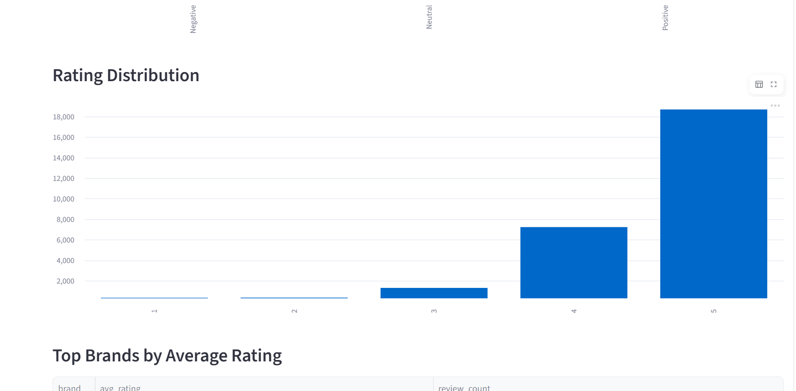
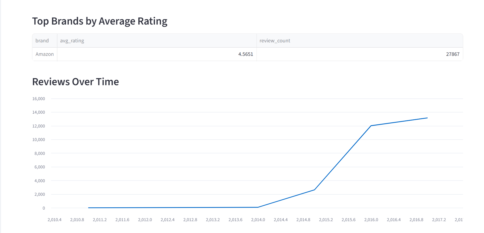
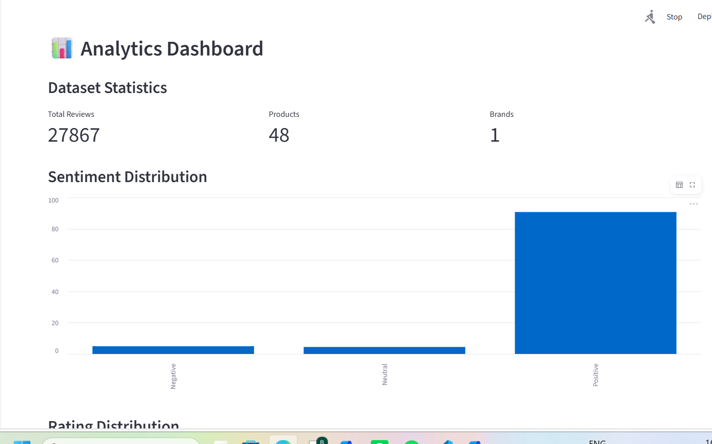
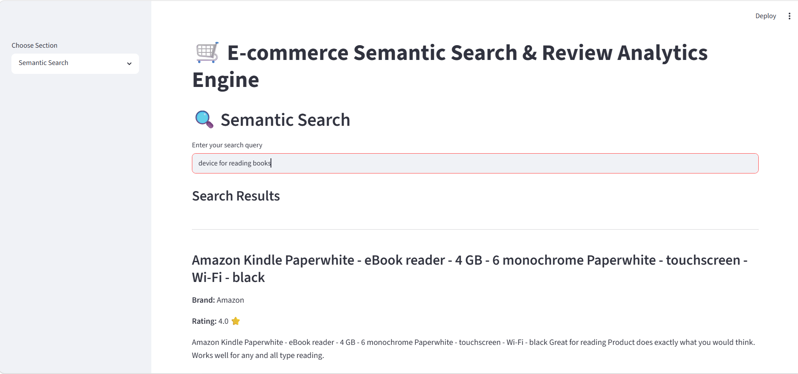

# 🛒 E-commerce Semantic Search & Review Analytics Engine

An NLP-powered application for searching, analyzing, and visualizing Amazon product reviews using semantic search and sentiment analysis.

## Overview

Traditional keyword search often fails to understand the intent behind a user's query. This project addresses that limitation by using vector embeddings and ChromaDB to perform semantic search over product reviews.

The application also includes an interactive analytics dashboard for exploring customer sentiment, rating distributions, brand performance, and review trends.

## Features

### 🔍 Semantic Search

* Search reviews using natural language queries
* Retrieve contextually relevant reviews instead of exact keyword matches
* Powered by Sentence Transformers and ChromaDB

### 😊 Sentiment Analysis

* Classifies reviews as Positive, Neutral, or Negative
* Built using VADER Sentiment Analysis

### 📊 Analytics Dashboard

* Sentiment distribution
* Rating distribution
* Brand-level statistics
* Review trends over time
* Dataset summary metrics

## Tech Stack

| Component          | Technology            |
| ------------------ | --------------------- |
| Language           | Python                |
| Data Processing    | Pandas                |
| NLP                | Sentence Transformers |
| Vector Database    | ChromaDB              |
| Sentiment Analysis | VADER                 |
| Dashboard          | Streamlit             |

## Dataset

The project uses a dataset containing more than 34,000 Amazon product reviews, including:

* Product information
* Ratings
* Review titles
* Review text
* Review timestamps

Products include Amazon Echo devices, Fire TV, Kindle readers, and Fire Tablets.

## Installation

```bash
git clone <your-github-repo-link>
cd Ecommerce_Semantic_Search_Engine

python -m venv venv
venv\Scripts\activate

pip install -r requirements.txt
```

## Run Application

```bash
streamlit run app.py
```

Application will be available at:

```text
http://localhost:8501
```

## Screenshots

### 📊 Analytics Dashboard







### 🔍 Semantic Search




## Project Structure

```text
Ecommerce_Semantic_Search_Engine
│
├── data
├── notebooks
├── src
├── app.py
├── requirements.txt
└── README.md
```

## Future Improvements

* Persistent vector database storage
* Product recommendation system
* Review summarization using LLMs
* Advanced filtering by category, rating, and date
* Cloud deployment

## Author

**Basudora Mukunda Priya**
B.Tech CSE (Data Science)
Raghu Engineering College

GitHub: https://github.com/MukundaPriyaBasudora

```
```
